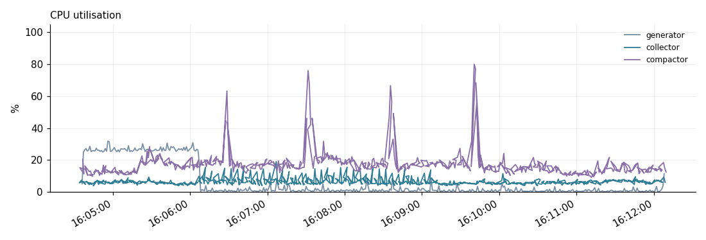
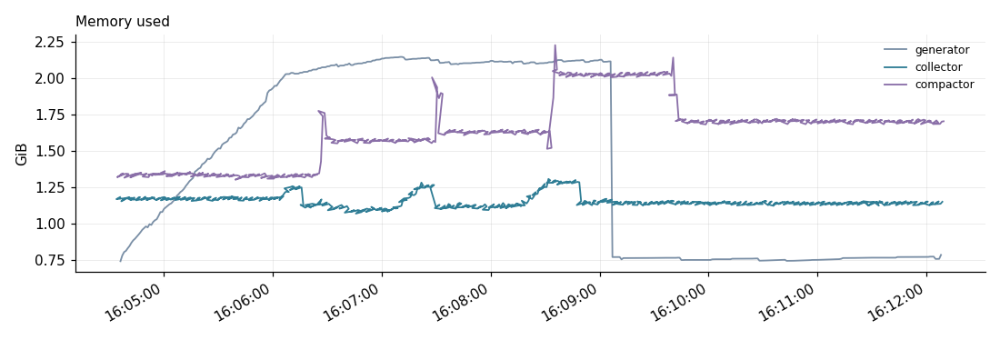
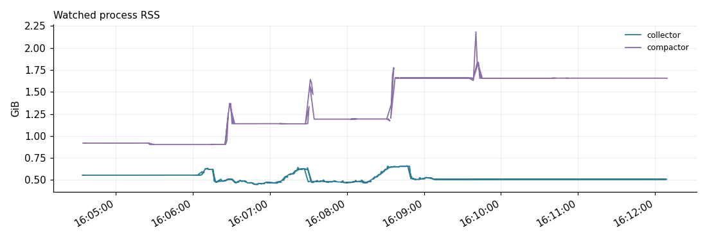
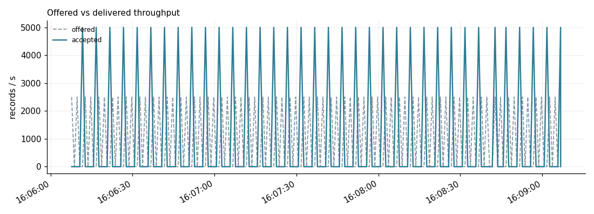
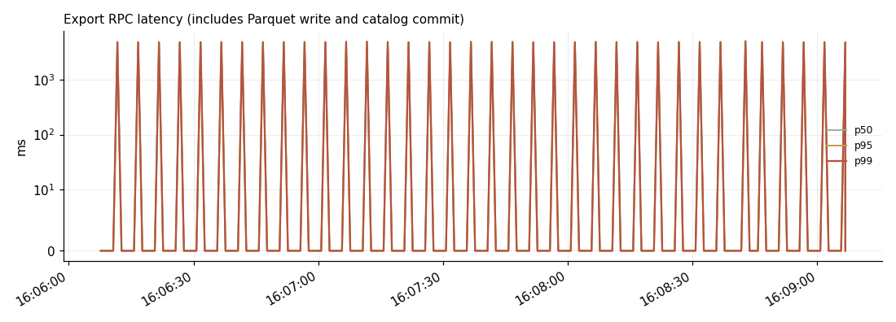
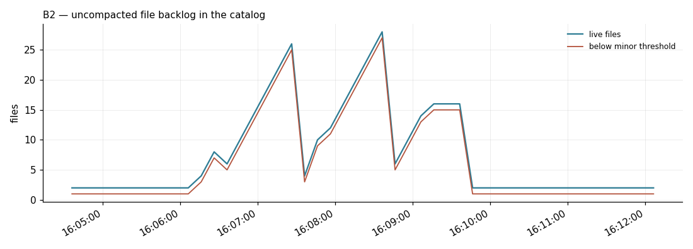

# Test Report — 20260915-160407-throughput

## Bottom line
**Every step passed cleanly** — zero rejected, zero lost. Highest rate tested: **1,000 rec/s**.

- Offered: 180,000 records
- Accepted: 180,000 records
- Rejected: 0 records
- Mean latency p50/p95/p99 (ms): 2,495.4 / 4,863.0 / 4,995.1

## Hardware

| Server | Instance type | CPU | RAM |
|---|---|---|---|
| Server 1 (generator) | t3.xlarge | 4 vCPU | 15.4 GB |
| Server 2 (collector) | t3.2xlarge | 8 vCPU | 31.0 GB |
| Server 3 (compactor) | t3.xlarge | 4 vCPU | 15.4 GB |

## Real CPU / RAM usage during this run

| Server | CPU (min / avg / max) | Memory used % (min / avg / max) |
|---|---|---|
| Server 1 (generator) | 0% / **6.3%** / 32% | 4.8% / 9.2% / **13.9%** |
| Server 2 (collector) | 4% / **6.5%** / 19% | 3.5% / 3.7% / **4.2%** |
| Server 3 (compactor) | 9% / **17.5%** / 80% | 8.4% / 10.6% / **14.4%** |

## Per-step results

| Target rec/s | Offered | Accepted | Rejected | Ratio |
|---|---|---|---|---|
| 1,000 | 180,000 | 180,000 | 0 | 1.0000 |

## How big a generator VM do we need for 30k → 200k rec/s?

The generator is Python `threading`-based, so it's bound by the GIL: a single
process can't use more than about one core's worth of Python execution no
matter how many vCPUs the box has. A bigger single VM does **not**
proportionally increase throughput. The proven, low-risk path is horizontal:
run multiple generator hosts of **today's exact spec** (t3.xlarge, 4
vCPU, 15.4 GB) in parallel, each generating up to the rate proven
clean in this run (**1,000 rec/s**), and aggregate their output.

| Target aggregate rate | Generator hosts needed (1,000 rec/s each) |
|---|---|
| 30,000 | 30 |
| 50,000 | 50 |
| 75,000 | 75 |
| 100,000 | 100 |
| 150,000 | 150 |
| 200,000 | 200 |

**Note:** the current generator instance (`t3.xlarge`) is *burstable* (T-series) -- fine at low average CPU (this run averaged well under half a core), but sustained high-rate generation over a long test can exhaust CPU credits and throttle mid-run. For any per-host rate pushed meaningfully above what's proven here, use a non-burstable equivalent (e.g. `m5.large`) instead.

This sizing covers the **generator only**. It says nothing about whether the
collector or compactor can sustain that aggregate rate -- that is the actual
open question a multi-host campaign would answer, since both have shown
large unused headroom at every rate tested so far.

---
*Generated automatically by `bench/publish_report.py` from `results/20260915-160407-throughput/` — not hand-edited. Full harness-native report: `results/20260915-160407-throughput/report.md`.*
