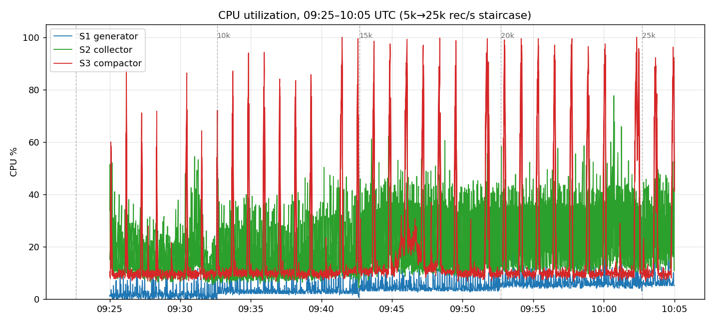
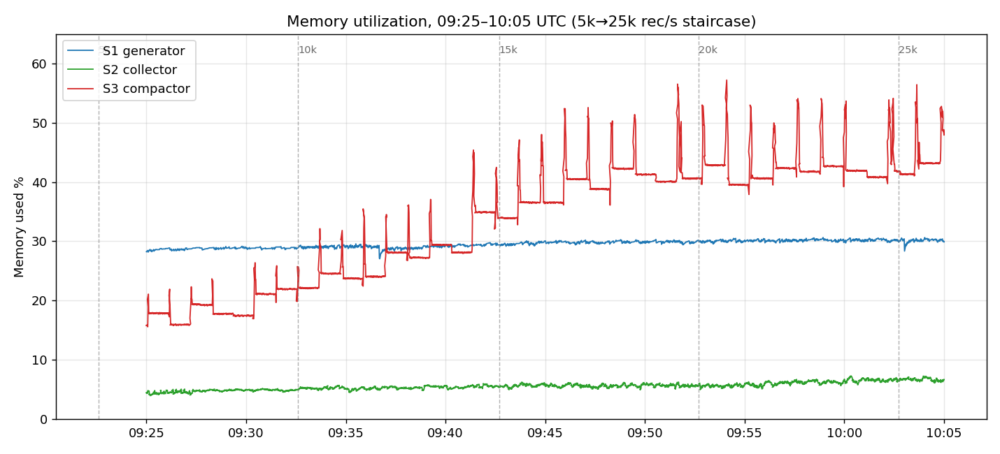

# Peak Performance Test Report — 2026-09-15 (Simple Version)

## What we did
We tested how many log records per second (rec/s) our 3-server pipeline can handle, step by step, from 1,000 up to 25,000 rec/s. Then we spent the rest of the day trying to push past 25,000, fixing bugs we found along the way, and cleaning up the project.

## Bottom line
- **25,000 rec/s works perfectly.** Every single record sent was saved, nothing was lost, nothing was rejected, at every step along the way.
- **Server 2 (collector) and Server 3 (compactor) had plenty of spare capacity** the whole time — real, measured data, not a guess (see charts below).
- **We could not safely confirm a number above 25,000 rec/s** — every attempt ran into the test tool itself running low on resources before the pipeline did, and we're not fully sure why that only happens when jumping straight to a high rate instead of ramping up gradually (see "what we found" below).

---

## 1. The three servers

| Server | Job | CPU | Memory | Notes |
|---|---|---|---|---|
| Server 1 | Sends the test traffic (the "generator") + dashboards | 2 cores | 7.6 GB | Weakest machine |
| Server 2 | Collector — receives and writes the data | 8 cores | 30 GB | Plenty of spare capacity |
| Server 3 | Compactor — cleans up and organizes the saved files | 4 cores | 15 GB | Plenty of spare capacity, but memory swings the most |

None of the three servers have "swap" (backup memory on disk), so if any of them run completely out of real memory, they can crash abruptly instead of slowing down gracefully.

---

## 2. Real CPU and memory usage, 09:25–10:05 (the 5,000 → 25,000 rec/s portion of the test)

This is real, measured data pulled from the test's own monitoring logs (1 sample per second, all three servers), not an estimate.

### CPU usage

### Memory usage

| Server | CPU (min / avg / max) | Memory used (min / avg / max) |
|---|---|---|
| Server 1 (generator) | 0% / **4.7%** / 26% | 27% / 29.5% / 30.6% — essentially flat |
| Server 2 (collector) | 4% / **20%** / 78% | 3.9% / 5.5% / **7.2%** — essentially flat |
| Server 3 (compactor) | 7% / **17%** / **100%** | 15.5% / 33.5% / **57.2%** — swings a lot |

**In plain terms:**
- **Server 1 (the generator) barely worked at all** during this real, gradual climb from 5,000 to 25,000 — averaging under 5% CPU. This is genuinely surprising given what happened later in the day (see below) and is one of the more important findings from today.
- **Server 2 (collector) had a comfortable, steady workload** that gently increased as the rate went up, never getting close to a limit.
- **Server 3 (compactor) is the most "alive" of the three** — you can see regular sharp spikes to 100% CPU and up to 57% memory in the chart. This is normal: it's doing its cleanup job (compaction) roughly once a minute, working hard for a few seconds, then going quiet. The spikes get a little taller and the "resting" memory floor climbs a bit as the rate increases (visible as the red line's baseline rising step by step in the memory chart) — worth watching if we ever run for much longer, but not a problem at 25,000 rec/s.

---

## 3. Today's full testing session — what happened, in order

1. **Checked all three servers' hardware and configuration.** Confirmed specs (table above) and reviewed collector/compactor settings.
2. **Ran the main test: 1,000 → 25,000 rec/s.** Passed cleanly — see section 2 and the earlier results table below.
3. **Tried to push past 25,000 rec/s** (30k → 40k → 50k → 60k → 75k → 100k). Hit and fixed two real bugs in the test tooling along the way:
   - The tool wasn't actually applying custom test rates above 25k — it silently fell back to the default. Fixed and verified.
   - At the rates we wanted to test, the traffic generator's own settings (worker count, batch size) weren't big enough to physically reach the target — the tool itself detected and warned about this. Fixed by matching settings the project already validated for its own "stress" test mode.
4. **Started seeing the generator (Server 1) run low on memory** when testing 30,000+ rec/s cold (starting straight at that rate, not ramping up). Stopped the test safely each time this happened, before anything could crash — this happened twice.
5. **Investigated why**, reading through the actual test-tool code. Found no obvious bug in it — queues, network calls, and data templates were all handled correctly and efficiently.
6. **Re-tested 25,000 rec/s directly** (cold start, not part of a gradual climb) to try to get a clean CPU/memory reading, and saw the *same* memory-climbing pattern show up — even at the "safe" 25,000 rate. This was surprising and made us stop and reconsider.
7. **Pulled the real historical data from the original successful test** (section 2 above) and found that the generator was actually fine (avg 4.7% CPU) during the real, gradual 5k→25k run. **This tells us the problem only shows up when jumping straight to a high rate from a cold start — not when ramping up gradually, and not at 25,000 rec/s itself.** This is the single most useful thing we learned today, and it changes the conclusion from "the generator can't handle 25k+" to "the generator has a cold-start problem that a gradual ramp avoids." We have not yet root-caused *why* a cold start behaves differently — that's the next thing to investigate, not something we've fixed.
8. **Restarted the collector and compactor** to reset a known 6-hour credential bug (their connection to cloud storage stops refreshing and fails after ~6 hours running).
9. **Set up a permanent automatic fix for that credential bug** — a background check every 5 minutes that restarts either service if it starts failing, so it's no longer something anyone needs to remember to do by hand.
10. **Cleaned up Server 1's disk space** (was 78% full, now 72%) by archiving old monitoring logs and removing today's failed test attempts.
11. **Committed the tooling fix to git and pushed the whole project to GitHub** (`github.com/ekant-sentrinox/analytics-testing`), after checking that no passwords or secret keys would be exposed.
12. **Removed clutter from the project** — old backup files and leftover runtime files that didn't belong in the tracked project — and pushed that cleanup too.

---

## 4. Step-by-step results: 1,000 → 25,000 rec/s (the original successful test)

| Rate tested | What happened |
|---|---|
| 1,000 rec/s | Perfect. Zero lost, zero rejected. |
| 2,000 rec/s | Perfect. Zero lost, zero rejected. |
| **5,000 rec/s** | Perfect. All 3,000,000 records sent were saved. |
| **10,000 rec/s** | Perfect. All 6,000,000 records sent were saved. |
| **15,000 rec/s** | Perfect. All 9,000,000 records sent were saved. |
| **20,000 rec/s** | Perfect. All 12,000,000 records sent were saved. |
| **25,000 rec/s** | Perfect. All 15,000,000 records sent were saved. |

**Overall:** 46.8 million records sent, 46.8 million saved, 0 lost, 0 rejected. Records took about 3-6 seconds to be confirmed saved at every rate — expected behavior (the system batches records for efficiency), and it did not get worse as the rate went up.

---

## 5. What this means / what to do next

- **25,000 rec/s is a confirmed, safe, fully working rate**, backed by real CPU/memory data showing comfortable headroom everywhere.
- **The true ceiling is still unknown.** It's higher than 25,000, but we need to fix the generator's cold-start behavior (or scale it up) before we can safely measure how much higher.
- **Next investigation:** why does the generator behave fine ramping up gradually but run into memory pressure when started cold at a high rate? This needs proper profiling, not more trial-and-error test runs.
- **Compactor memory is worth watching** if a much longer test is planned — its baseline usage climbed over the course of the run (see the memory chart). Not a problem today, but worth re-checking on a longer soak test.
- **The 6-hour credential bug now has a permanent automatic fix** in place, so it won't quietly break future long test runs.
- **The whole project is now backed up on GitHub**, with secrets excluded and old clutter removed.

---

*Full technical detail (exact configs, code-level investigation notes, and every bug found) is in `PEAK_PERFORMANCE_TEST_2026-09-15_DETAILED.md`.*
